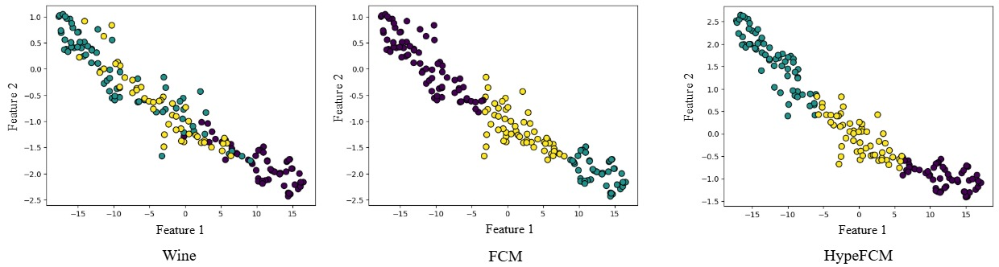

# Hyperbolic Fuzzy C-Means (HypeFCM) Clustering

[](https://opensource.org/licenses/MIT) 
[](https://www.python.org/)

**Official implementation** of the paper:  
*"Hyperbolic Fuzzy C-Means with Adaptive Weight-Based Filtering for Clustering in Non-Euclidean Spaces"*  
(Swagato Das, Arghya Pratihar, Swagatam Das).

👉 **Key Features**:  
- Hyperbolic distance computations using the **Poincaré ball model**.  
- Adaptive filtration to retain top-𝑘 most relevant cluster-point relationships.  
- Fuzzy membership initialization via **Dirichlet distribution**.  
- Visualization tools for 2D/3D clusters and ablation studies.  
- Benchmarks against FCM, K-means, and HSFC on synthetic/real-world datasets.

---

## 📥 Installation
1. Clone the repository:
   ```bash
   git clone https://github.com/yourusername/HFCM-Clustering.git
   cd HFCM-Clustering
   ```
2. Install dependencies:
   ```bash
   pip install -r requirements.txt
   ```

---

## 🚀 Quick Start

### Run HypeFCM on the Wine Dataset
```python# Example usage (works in .py and .ipynb)
if __name__ == "__main__":
    # Load data (replace with your dataset)
    data = np.genfromtxt("wine.csv", delimiter=",", skip_header=1)
    X = data[:, :-1]
    true_labels = data[:, -1].astype(int)
    
    # Run HFCM
    model = HFCM(n_clusters=3, curvature=1.0, filtration_k=5)
    model.fit(X)
    
    # Evaluate
    scores = model.evaluate(true_labels)
    print(f"ARI: {scores['ARI']:.3f}, NMI: {scores['NMI']:.3f}")
    
    # Visualize
    model.visualize(X, dim=2)
```

---

## 📊 Results

### Performance on Synthetic Datasets (ARI / NMI)
| Method       | Cure-t1-2000n | Smile1 | 3MC    |
|--------------|---------------|--------|--------|
| **HFCM**     | **0.923**     | **0.630** | **0.584** |
| FCM          | 0.471         | 0.542  | 0.584  |
| K-means      | 0.491         | 0.527  | 0.508  |



---

## ⚙️ Parameters
| Parameter      | Description                          | Default |
|----------------|--------------------------------------|---------|
| `n_clusters`   | Number of clusters                   | `3`     |
| `m`            | Fuzziness parameter (≥1)             | `2.0`   |
| `curvature`    | Curvature of hyperbolic space (≥0)   | `1.0`   |
| `filtration_k` | Top-𝑘 connections retained per point | `5`     |
| `max_iter`     | Maximum optimization iterations      | `1000`  |

---

## 📜 Citation
If you use this code, please cite the original paper:
```bibtex
@article{das2025hyperbolic,
  title={Hyperbolic Fuzzy C-Means with Adaptive Weight-Based Filtering for Clustering in Non-Euclidean Spaces},
  author={Das, Swagato and Pratihar, Arghya and Das, Swagatam},
  journal={arXiv preprint arXiv:XXXX.XXXX},
  year={2025}
}
```

---

## 📄 License
MIT License. See [LICENSE](LICENSE) for details.
